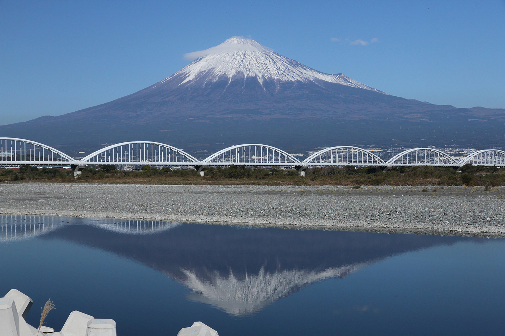

# Fuji Moneyとは? 
Fuji Moneyとは富士山とその麓の清掃活動を地域住民で行い、富士山を綺麗に保ち世界遺産登録を目指す仮プロジェクトです
 
 
 
 
内部リンク 

### [活動内容](./activities)  
#### [実施要項](./guide)  
#### [コインについて](./coin)  
#### [関係組織](./stakeholders)  
#### [アカウントの扱い方](./acount)  
